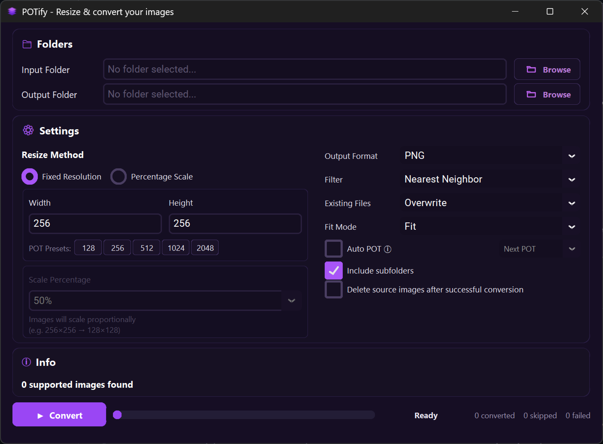

# POTify

POTify is a fast, lightweight Windows desktop utility for batch resizing and converting photos and general images. It provides a clean, responsive graphical interface alongside optional Power-of-Two (POT) dimension rounding for game assets and textures.

<a href="docs/potify-ui.png">
  
</a>

## Downloads

Download the latest standalone portable release (Windows x64):
- [Download POTify Release](https://github.com/GryAsl/POTify/releases/latest)

Extract the zip archive and run `POTify.exe`. No installation or external runtime required.

> **Windows SmartScreen Note**: The portable executable is currently unsigned. On first launch, Windows SmartScreen may present a warning. Click **More info** and select **Run anyway** to proceed.

## Key Features

- **Flexible Sizing**: Resize by percentage (proportionally scaling each image) or specify explicit fixed dimensions.
- **Fit Modes**: Choose between **Fit** (letterbox/pillarbox with transparency support), **Fill** (center-crop), and **Stretch**.
- **Power-of-Two Sizing**: Optional automated rounding of dimensions to the next or nearest Power-of-Two ($2^n$).
- **Format Support**: Cross-conversion between PNG, JPG, WebP, BMP, and TGA, or retain source formats.
- **Recursive Processing**: Scans input folder hierarchies and mirrors directory trees in output destinations.
- **Conflict Handling**: Select Overwrite, Skip, or automatic unique Renaming for destination name collisions.
- **Safe Source Deletion**: Optional deletion of original images only after successful conversion and disk verification, with guardrails preventing deletion when input and output directories match.
- **Responsive Background Processing**: Batch operations execute on background worker threads with smooth real-time telemetry and immediate cancellation support.

## Running from Source

### Prerequisites
- Python 3.11+
- Windows OS

### Setup and Execution

```powershell
# Clone the repository
git clone https://github.com/GryAsl/POTify.git
cd POTify

# Create and activate virtual environment
python -m venv .venv
.\.venv\Scripts\Activate.ps1

# Install dependencies
pip install -r requirements.txt

# Run the application
python main.py
```

## Testing

Run the test suite:
```powershell
python -m pytest -q
```

## Building Executable

To compile the standalone portable binary with PyInstaller:
```powershell
.\build_windows.ps1
```

The output binary and zip bundle will be generated in `release\`.
